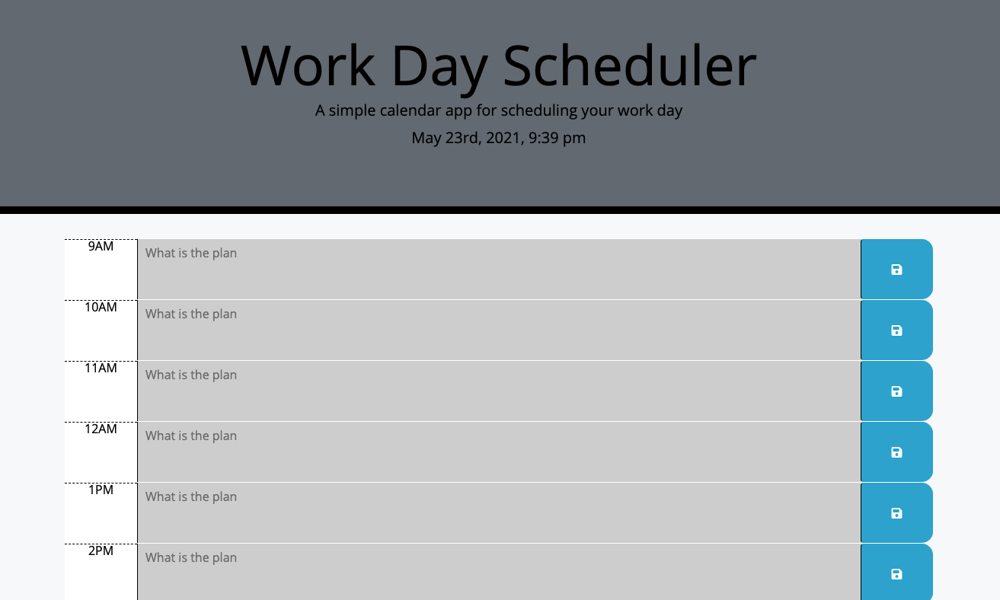
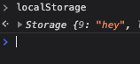

# Work-Day-Scheduler

We were tasked with creating a Work Day Scheduler that accepted an input and saved it to the Local Storage. It was also a requirement that the planner would be color coded depending upon the time of the day. We were given a jumbotron with the words Work Day Scheduler- A simple calendar app for scheduling your work day. We were also supplied with a helpful CSS page that had already created stylings for our time blocks and buttons. 

## What Came Next

From there we simply had to create classes inside of seperate 
 tags for each of our time blocks. They had to include sizing and the CSS styling that we desired. Inside of the 
 tags, we had to create a <textarea> tag, a button and a sibling 
 tag. We had to assign the proper classes inside of each of the attributes that we created to match the model planner that we were given. 

### Post Wire-framing

Once we had our page looking nice, we had to give it functionality. A JavaScript page was created and the Moment.js function was added to the jumbotron so that the viewer knows what time of day it is. I created a function that using jQuery to pull my classes and ID's allowed me to check whether a block was past, present, or future. If the hour on the screen is in the future, it will appear green. If it is in the past, it will appear grey. And, if it is the current hour, it will appear red. The only thing left to do was to set up my button. When the button is pressed, it takes that value that was entered into the <textarea> and saves it to the Local Storage. This allows that value to stay on the page even if the page is refreshed. 

#### Test Me Out

Click [Here](https://drock4440.github.io/Work-Day-Planner/)

